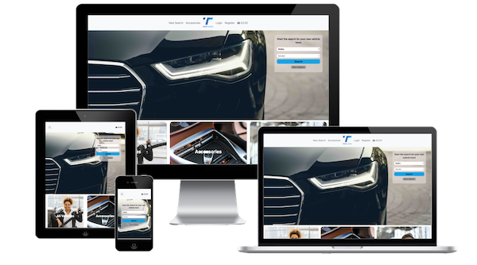

# Milestone Project 4 - Très Cars

## Project

The purpose of this site is to allow a user to browse and purchase a vehicle and browse and purchase accessories.

# Showcase

A deployed link to the site can be found on Heroku [here](https://tres-cars.herokuapp.com/)

# UX

## User Stories

|Story ID|As A/An|I want to be able to|So That I can|
|-----|-----|-----|----|
| Viewing and Navigation|
|1| Shopper | View all vehicles for sale | Find an appropriate vehicle |
|2| Shopper | View Details of a specific vehicle | View all relevant information related to that vehicle|
|3| Shopper | Calculate true cost of a vehicle | Have a full understanding of the cost |
|4| Shopper | View accessories for a vehicle | Choose what I would like to add to my vehicle |
| Filtering / Searching |
|5| Shopper | Search by a vehicle Make / Model | Find the available stock of a certain vehicle |
|6| Shopper | Filter the vehicles by attributes | Identify vehicles matching my wants |
|7| Shopper | Sort the available vehicles by an attribute | See the vehicles in an order of e.g price |
|8| Shopper | See the number of available vehicles | See how many options are available |
| Checkout / Purchasing |
|9| Shopper | Easily see the products to be purchased | Ensure correct product / vehicle is being purchased |
|10| Shopper | Adjust quantity of products to be purchased | See the total cost and add more of an item if needed |
|11| Shopper | Enter Payment Info | Checkout with problem |
|12| Shopper | Secure Checkout | Feel safe that details are secure |
| Registration |
|13| Site User | Easily Register for an account	| Have a personal account with recommendation for parts / servicing |
|14| Site User | Login / Logout	| Access personal account information |
|15| Site User | Recover password | Recover access to account |
|16| Site User | Email Confirmation	| Verify that account creation was successful |
|17| Site User | Personalised User Page	| View Order history, my vehicle, set service schedule |
| Administration |
|18| Site Admin | Add vehicles to the site | Update the site with new vehicle stock |
|19| Site Admin | Add products / accessories to the site | Update site with new accessories |
|20| Site Admin | Update Vehicle / Product Details on the site | Update the details of a specific vehicle |

## Strategy

### User Needs

A user needs to be able to easily see what the website offers. This will be done via the landing page of the site.
Each aspect of the page will be displayed easily for a used. all information will be easily accessible.

A user needs to be able to purchase a vehicle or accessories with ease and in as fewer steps as possible.

### Technical Capabilities

It is possible to create this site efficiently using the bootstrap and Django frameworks as well as the HTML/CSS/Javascript/Python and heroku for deployment and postgres of a database. The DVLA API will also be used for getting extra information on vehicles added to the database.
### Business Vision

Offer a wide variety of vehicles, from older vehicles to brand new ones and prices from affordable to luxury. THe site will also offer accessories for specific of all vehicles
## Scope

The site will quickly show what it's purpose is for a user. From the home page users will be ale to enact a simple vehicle search with a mode detail search to follow.

Information about the site can be found lower down on the home page, along with contact information and a location. The site will be easy to navigate and 
The site will include an about section detailing what the site does and what a user can gain from it. It will be easy to enact a search and read the results. All information will be clearly laid out and easy to understand at a glance

## Structure

- The site will be detailed but simply laid out, cover 20 pages in total with pages generated when clicked on.
- navigation will give quick access to the main features of the site
- Site pages 
    - Home, Returns, Login, Logout, Vehicle Search, Vehicle Details, Accessory Select, accessory search, accessory detail
    - Bag, Vehicle Checkout, Checkout, Checkout success, Profile, Management Home, Add Vehicle, Update Vehicle
    - Add Accessory, Update Accessory, contact Page
- A user will be able to quickly search for a vehicel form the home page, or run a more detail search from the vehicle search page. They will be able to select a type of accessory via the accessories link in the nav bar.
- Users can create a profile where purchases and account details can be stored
- An admin panel will be accesiable by admin users to allow for Adding/Updating Vehicles & accessories
## Skeleton

### Wireframes

- [Mobile >576px](static/wireframes/sm.png)
- [Tablet ≥768px](static/wireframes/md.png)
- [Desktop ≥1400px](static/wireframes/lg.png)

### Database Schema

- [Schema](static/wireframes/database_schema.png)

## Surface

The site will be set over multiple pages. Users will be able to search for a purchase accessories / vehicles
## Visual Design
### Home

- The page will contain a quick simple search for a vehicle
- An introduction and information panes wil lbe displayed futher down the page.

### Returns Page

- A simple page displaying the terms and conditions of sales and returns

### Contact Page

- A form to submit to the company.
- If the link to the page comes from a vehicle detail / accessory detail page, the informaiton onf the itme is included.
### Vehicle Search Page

- Linked to via the quick search and more options on the home page or via the New Search button in the header
- Without a search, contains all the vehicles on the site, with a search, displayed the matching vehicles.
- Able to filter vehicles by pre-defined search parameters.
- Sort the returned vehicles

### Vehicle Detail Page

- shows all the details and images of the selected vehicle
- able to see live data from DVLA api on the MOT,TAX and Co2 status
- Able to go to contact page taking the vehicle info
- Able to click to reserve the vehicle
- if an admin, vehicles can be updated/deleted
### Vehicle Reserve Page

- Can only take 1 vehicle at a time
- Enter user data, or pre-filled if user logged in with saved data
- Enter payment details and reserve vehicle
- Confirmation mail sent to customer
- Info email sent to company

### Accessories Page

- Shows the categories of accessories available
- Clicking one filters the accessories by the category
- Search box available to search by term

### Accessories Search Page

- displays all accessories available for the category
- Accessories can be sorted
- Search box available to search by term
- if an admin, accessories can be updated / deleted
### Accessory Detail Page

- Displays the image and data available for the accessory
- Add to bag link for added teh accessory to bag
- "+ / -" buttons for changing quantity required
- if an admin, accessories can be updated / deleted
- Able to go to contact page taking the accessory info
### Bag Page

- Displays all the accessories currently in the bag
- Link to more accessories
- Link to the secure checkout page
### Acessories Checkout Page

- Enter user data, or pre-filled if user logged in with saved data
- Enter payment details and complete order
- Confirmation mail sent to customer
- Info email sent to company

## Admin Pages
### Management Home

- Displayed the links to Add A vehicle or accessory

### Add vehicle

- Allows a vehicle to be added
- Allows text information
- Allows multi image upload with the requirement to select a main image

### Update a vehicle

- Accessed via vehicles search page or vehicle page
- Allows text information to be edited
- Allows images to be removed
- Allows a new main image to be selected
- Allows more images to be added

### Add an acessory
- Allows an accessory to be added
- Allows text information
- Allows single image upload

## Visual Design

The colour scheme of the site will be Blue,  White, Black, Dark Blue

#12a3e5, #FFFFFF, #000000, #3943B7

## Features

### Existing Features
#### Users

- View all vehicles
- filter vehicle
- view a vehicle's information
- reserve a vehicle
- search all accessories
- view accessory categories
- view an accessory's detail
- add accessory to basket
- purchase multiple accessories
- view their orders in profile
- delete their account
- contact company with query
#### Admin

- Add a vehicle to the database
- update a vehicle in the database
- remove a vehicle from the database
- Add a accessory to the database
- update a accessory in the database
- remove a accessory from the database

### Features to be implemented

- Service Reminders on profile page
- MOT Reminders on profile page
- order status on profile page

## Technologies used

- HTML
    - Font Awesome CDN
- CSS
    - Bootstrap (Styling Framework)
- Javascript
    - Jquery & Vanilla
    - stripe
- API
    - DVLA API (getting Vehicle Info)
- Django (Framework)
- Heroku (Deployment)
- Postgres (Database)
- AWS S3 Bucket (Storage)

# Testing
## Planning

## Running Tests

- Testing the HTML code was tested by generating a page and copying the HTML/url into the [W3C](https://validator.w3.org/) HTML Validator
- Testing the CSS was tested with the [W3C](https://jigsaw.w3.org/css-validator/validator) validator
- Testing Javascript was tested with [Beautify Tools](https://beautifytools.com/javascript-validator.php)
- Testing Python was tested with [Python Tester](https://extendsclass.com/python-tester.html)

### HTML5 
#### User

- index.html
    - Removed unused attributes on select and a elements
    - Passed
- returns.html
    - Passed
- vehicles.html
    - removed unused attributes from select elements
    - Passed
- vehicle_detail.html
    - Passed
- reserve_vehicle_checkout.html
    - Own Code Passes
    - Stripe auto populated elements have issues
- checkout_success.html
    - Passed
- accessories.html
    - Removed unused attributes
    - Passed
- accessories_search.html
    - Removed unused attributes
    - added action to search form to conform
    - Passed
- accessories_detail.html
    - Removed unused heading
    - changed the way js adds disabled attribute
    - Passed
- bag.html
    - too many table row to headers. Corrected
    - Passed
- checkout.html
    - Own Code Passes
    - Stripe auto populated elements have issues
- profile.html
    - Passed

#### Admin

- home.html
    - correct a paragraph in a span
    - Passed
- add_vehicle.html
    - removed placeholder from select elements
    - Passed
- add_accessories.html
    - removed placeholder from select elements
    - Passed
- update_vehicle.html
    - non-required label removed
    - Passed
- update_accessory.html
    - added alt to img field
    - Passed
### CSS3 

- base.css
    - Error with a colour spelt wrong. Corrected
- vehicles.css
    - Passed, No Errors
- profile.css
    - Passed, No Errors
- management.css
    - Passed, No Errors
- checkout.css
    - Passed, No Errors
- accessories.css
    - Passed, No Errors

### Javascript

- vehicles.js
    - Missing semicolons. Corrected
- vehicle_detail.js
    - Missing semicolons. Corrected
- home-script.js
    - variable not defined. Added let
- profile.js
    - Missing semicolons. Corrected
- add_accessory.js
    - Missing semicolons. Corrected
- add_vehicle.js
    - Missing semicolons & unused code. corrected
- update_vehicle.js
    - Missing semicolons. Corrected
- stripe.js
    - No errors
- bag.js
    - unused code removed
- accessories.js
    - Missing semicolons. Corrected
- accessory_detail.js
    - Missing semicolons. Corrected

### Python
## tres_cars (project)

- settings.py
    - Pass
- urls.py
    - Pass
## Vehicles

- admin.py
    - Pass
- models.py
    - Pass
- views.py
    - Pass
- urls.py
    - Pass

## profiles

- forms.py
    - Pass
- models.py
    - Pass
- views.py
    - Pass
- urls.py
    - Pass

## management

- forms.py
    - Pass
- models.py
    - Pass
- urls.py
    - Pass
- views.py
    - Pass
- widgets.py
    - Pass

## home

- urls.py
    - Pass
- views.py
    - Pass

## checkout

- admin.py
    - Pass
- forms.py
    - Pass
- models.py
    - Pass
- signals.py
    - Pass
- urls.py
    - Pass
- views.py
    - Pass
- webhook_handler.py
    - Pass
- webhooks.py
    - Pass

## bag

- contexts.py
    - Pass
- urls.py
    - Pass
- views.py
    - Pass

## accessories

- admin.py
    - Pass
- models.py
    - Pass
- urls.py
    - Pass
- views.py
    - Pass

### Lighthouse Results

The lighthouse results can be found [Here](testing.md)

## Testing Results

### Bugs that occured

- the loading gif for checkout was causing loading issues with the page.
    - converted to WebM/mp4 and used video element
- home button on login / register page mis-sized on mobile
    - added media query for correct sizing
## Bugs/Changes During Development

- sort wasn't working for sort
    - sort option wasn't defined. Fixed
- Stripe payment pane wasn't appearing
    - JS was deferred
- Vehicle inputs wrong colour on mobile
    - Had to override defaul a link colour
## Deployment
During development the DEVELOPMENT variable was set. For deployment the Procfile was set to: web: gunicorn tres_cars.wsgi:application and DEVELOPMENT remove from variables

Deployment of the site was done using Heroku, Postgres and AWS as follows

- Created an account with Heroku
- Created a New App
- Gave the App a unique name(tres-cars) and selected a local region
- Under Deployment method selected Git Hub
- Under Resources, Postgres was installed as the database
- Connected my gitHub account to herku and the selected the correct repo for the site
- Under Automatic Deploys, the main branch was selected and Enable clicked

For storage, an AWS bucket was used.
- create an aws account
- search for s3 service
- create a new bucket:
    - give name, select a close server, uncheck 'block all public access'
    - settings on bucked:
        - properties: static, used to host a website
        - permissions
            - CORS, set config policy
            - bucket policy, use the policy generator: Type- s3 bucket policy. Allow all principles (*). service- Amazon S3. Action - GetObject
                - Copy ARN from bucket policy page and enter it in the ARN input
                - Add statement then generate policy and copy policy into the bucket policy editor
                - add /* onto the end of the resource key to give access to all resources
            - Access control list - Public Access: Everyone
- search for IAM in AWS
    - create a group with relevant name
    - click policy then create policy
        - click JSON tab a click Import managed policy
        - import AmazonS3FullAccess and click import
        - change the * to a list, first item the ARN, second the ARN + /*
        - review policy, give it a name / description and create
    - go to groups then the new group
    - click attach policy, search for the policy and attach it.
    - form the users page, click add user
    - create a user with programmatic access and add them to the new group
    - Download the CSV files with the users access key / secret access key

- In Heroku, under the settings heading, reveal config vars
- Keys & Values were entered for:

AWS_ACCESS_KEY_ID(user), AWS_SECRET_ACCESS_KEY(user), DATABASE_URL(Postgres), DEFAULT_FROM_EMAIL, DEFAULT_RECEIVING_EMAIL, DVLA_API_KEY, EMAIL_HOST_PASS, EMAIL_HOST_USER, SECRET_KEY, STRIPE_PUBLIC_KEY, STRIPE_SECRET_KEY, STRIPE_WH_SECRET, USE_AWS(TRUE)

- Once all keys and value are entered the variables are set up
- When branches are merged into main, the latest app will be deployed

- To Clone the repo, go to [Repo](https://github.com/cod182/Milestone-Project-4)
- Click Code
- Choose either option:
- Open with GitHub Desktop
- Download as Zip
- You can now open the project in a IDE or host to a server
- Alternatively you can follow the steps above to deploy the app on Heroku with postgres and AWS
- Your own values for each key will be needed
# Credits

- Images on home page were provided by [pexels](https://www.pexels.com/) under a free to use licence
- small icons on the vehicle_details page were provided by [icons-icon](https://icon-icons.com/) under a free to use licence
- The loading gif on teh checkout page was provided b [acegif](https://acegif.com/) under a free to use licence
- The image from the e404 error page was from [flaticon](https://www.flaticon.com/free-icon/car-breakdown_814412)
- djangoprojects.com was used for help with a variety of django features. eg. pagination
- [pypi](https://pypi.org/project/django-mathfilters/) was used for help with mathfilters
- [Samuel Torimiro's article](https://www.section.io/engineering-education/how-to-send-email-in-django/) was used for help on sending emails with django
- help on uploading multipel images into table was provided by users on stackoverflow [here](https://stackoverflow.com/questions/34006994/how-to-upload-multiple-images-to-a-blog-post-in-django) and [here](https://stackoverflow.com/questions/60111139/upload-multiple-images-at-once-django)
## This project is for educational purposes only

### Created by Codie Stephens-Evans