# Testing Documentation

## Lighthouse Results

|Page|Device|Result|
|-----|-----|-----|
|Home|Desktop||
|Home|Mobile||
|Returns|Desktop||
|Returns|Mobile|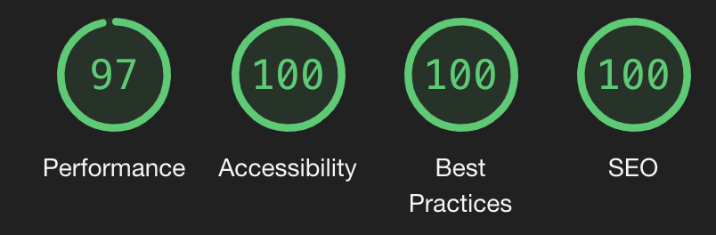|
|Contact|Desktop||
|Contact|Mobile|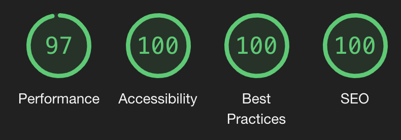|
|Vehicles|Desktop||
|Vehicles|Mobile|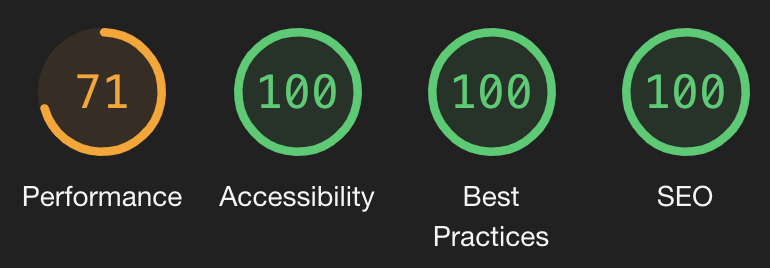|
|Vehicle Detail|Desktop|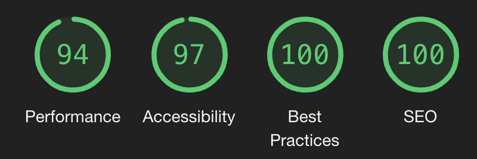|
|Vehicle Detail|Mobile|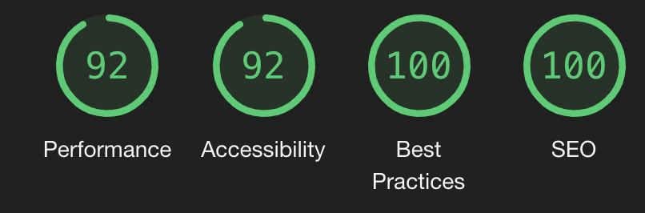|
|Vehicle CHeckout|Desktop|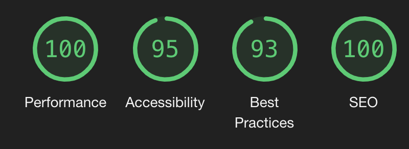|
|Vehicle Checkout|Mobile|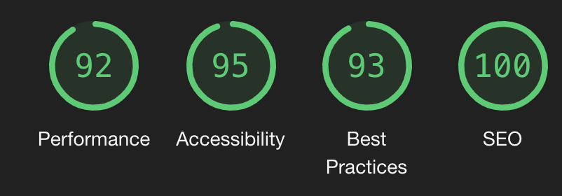|
|Accessory Categories|Desktop|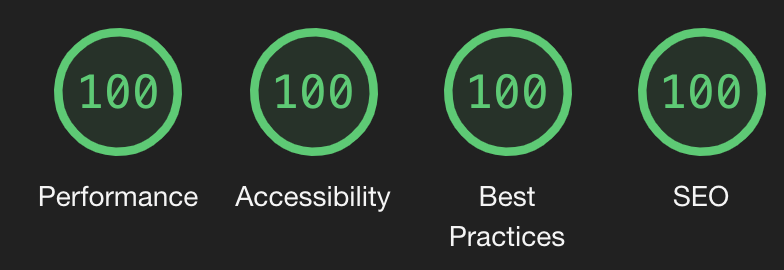|
|Accessory Categories|Mobile||
|Accessories Search|Desktop|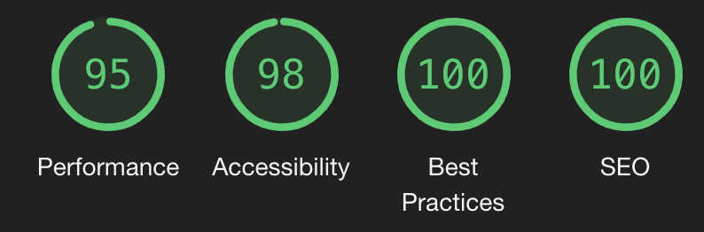|
|Accessories Search|Mobile||
|Accessory Detail|Desktop|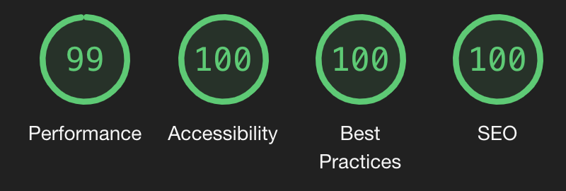|
|Accessory Detail|Mobile||
|Bag|Desktop||
|Bag|Mobile|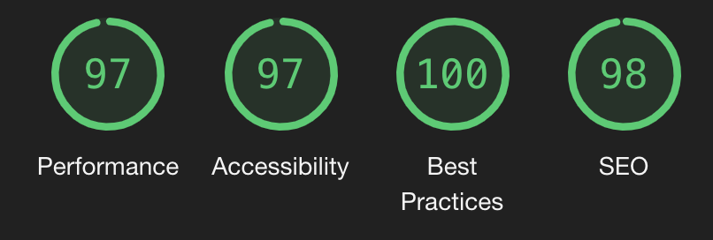|
|Checkout|Desktop|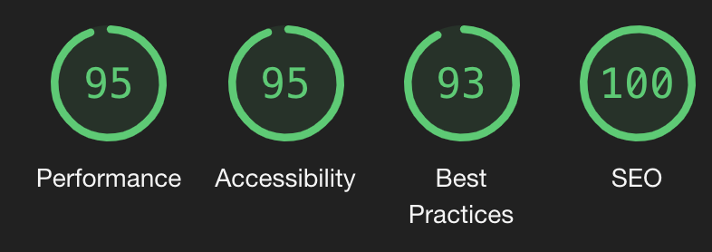|
|Checkout|Mobile||
|Checkout Success|Desktop||
|Checkout Success|Mobile||
|Login|Desktop||
|Login|Mobile||
|Logout|Desktop||
|Logout|Mobile||
|Profile|Desktop||
|Profile|Mobile|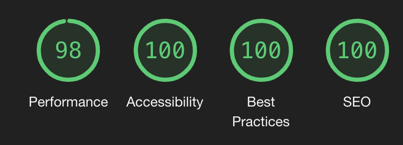|
|Management Home|Desktop||
|Management Home|Mobile|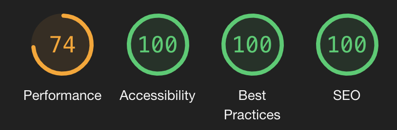|
|Add Vehicle|Desktop||
|Add Vehicle|Mobile|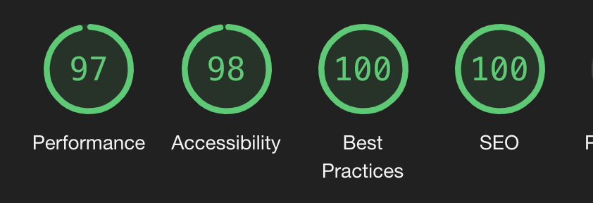|
|Add Accessory|Desktop||
|Add Accessory|Mobile||
|Update Vehicle|Desktop||
|Update Vehicle|Mobile||
|Update Accessory|Desktop||
|Update Accessory|Mobile||

## Testing
### Process

#### User

- Load Site
- Click a link to search for a vehicle or search for make / model of car
- View search results
- Reset search page
- Filter vehicles
- View results
- Click on a vehicle
- Click reserve vehicle
- Enter use details and card details
- Make payment
- View success screen
- Register for an account
- Click on Accessories
- Choose and accessory, add to basket
- Choose another accessory, add multiple to basket
- Click on bag
- Click Secure Checkout
- Enter details and make payment
- View success page
- View profile
- View order

#### Admin

- Click Manage
- Click Add Vehicle
- Fill out info, upload pictures
- Click Add Vehicle
- Click Update
- Change some text and add an image and change main image
- Click Update
- Click Delete
- Click Manage
- Click Add Accessory
- Fill out info and add picture
- Click Add Accessory
- Click Update
- Change text
- Click Update
- Click Delete

### Testing in Chrome Developer Tools
### iPhone SE 375x667

- Vehicle reserve button's POST request didn't have an order_type
- JS active on management home, removed
- new accessory add not saving
- confirmation to delete on accessory page not active
---
### iPhone XR 414x896

---
### iPhone 12 390x844

---
### iPad mini 768x1024

---
### iPad Air 820x1180

---
## Handheld Device Realworld Testing - Testing Log
---
### iPhone 13 Pro Max (Safari)

### iPhone 13 Pro Max (Chrome)

---
### iPhone 12 Pro (Safari)

---
### iPad Pro 11" (Safari)

---
### Samsung A40 (Chrome)

---
## Screen Testing - Testing Log
---

### Laptop 16" Screen 3072x1920

---
### iMac 5k 27" Screen 5120x2880

---